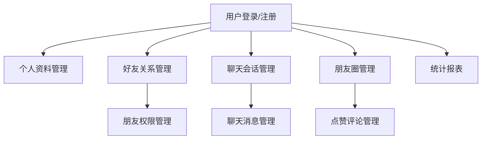
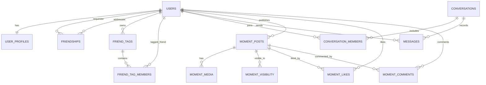

# 微信式个人资料与聊天记录管理系统设计说明

## 1. 课程要求对应关系

根据《数据库课程设计题目及要求-2026.pptx》，成绩评定重点如下：

- 第一次课堂演讲 30 分：功能需求分析 10 分、性能及其他需求分析 5 分、数据库设计 15 分，重点讲需求分析、用例图、ER 图、实体和实体关系。
- 第二次课堂演讲 30 分：演示代表性的完整业务流程，以及至少 3 个统计功能；功能 16 分、健壮性 8 分、易用性 6 分。
- 课程设计报告 40 分：数据库概念设计和逻辑设计 20 分，数据库规划、系统定义、需求分析 15 分，物理设计和其他 5 分。
- 数据要求：实体数据不少于 30 条，关联关系数据不少于 200 条。

本系统用 Python 作为高级程序设计语言，MySQL 作为唯一 DBMS，设计成一个以数据库为核心的社交资料和聊天记录管理系统。程序通过 PyMySQL 连接 MySQL，所有建表、约束、视图、触发器、存储过程均采用 MySQL 语法实现。

## 2. 系统定义

系统名称：微信式个人资料与聊天记录管理系统。

系统目标：管理用户个人资料、好友关系、好友权限、聊天会话、聊天消息、朋友圈发布与互动记录，并提供面向管理员或用户的统计查询。

系统边界：

- 本系统模拟微信核心数据管理，不实现真实即时通信推送。
- 重点在数据库设计、业务流程和数据查询统计。
- 控制台程序用于课程演示，底层数据必须存储在 MySQL 中；数据库结构可以扩展到 Web 或桌面客户端。

## 3. 功能需求分析

### 3.1 用户与个人资料模块

- 用户注册、登录。
- 维护昵称、性别、地区、签名、头像地址等资料。
- 查看个人资料和账号状态。

### 3.2 好友与权限模块

- 发起好友申请。
- 同意或拒绝好友申请。
- 查看好友列表。
- 设置备注名。
- 设置朋友权限：是否允许聊天、是否允许对方看我的朋友圈、是否允许我看对方朋友圈、是否拉黑。

### 3.3 聊天记录模块

- 创建私聊会话。
- 创建群聊会话。
- 发送文本消息。
- 查询指定会话聊天记录。
- 按关键词检索消息。

### 3.4 朋友圈模块

- 发布朋友圈动态。
- 设置动态可见范围：公开、仅朋友、私密、指定可见。
- 点赞朋友圈。
- 评论朋友圈。
- 查询自己可见的朋友圈列表。

### 3.5 统计报表模块

至少演示 3 个统计功能：

- 用户消息量排行。
- 朋友圈互动量排行。
- 好友权限分布统计。
- 会话活跃度统计。

## 4. 性能与其他需求

- 数据完整性：使用主键、外键、唯一约束、检查约束维护数据一致性。
- 查询性能：对账号、好友、会话、消息时间、朋友圈发布时间等字段建立索引。
- 安全性：密码用 SHA-256 摘要存储，避免明文存储。
- 健壮性：Python 端捕获数据库异常，输入参数做基本校验。
- 可维护性：数据库访问、菜单交互、业务功能分层组织。
- 可扩展性：会话表支持私聊和群聊，朋友圈可见范围支持指定用户可见。

## 5. 模块设计

## 6. ER 图设计

## 7. 主要数据表

| 表名 | 含义 | 关键字段 |
| --- | --- | --- |
| users | 用户账号 | user_id, wechat_id, phone, password_hash |
| user_profiles | 用户资料 | user_id, nickname, gender, region, signature |
| friendships | 好友关系和权限 | requester_id, addressee_id, status, can_chat, can_view_my_moments |
| friend_tags | 好友标签 | tag_id, owner_id, tag_name |
| friend_tag_members | 标签成员 | tag_id, friend_id |
| conversations | 会话 | conversation_id, conversation_type, title |
| conversation_members | 会话成员 | conversation_id, user_id |
| messages | 消息 | message_id, conversation_id, sender_id, content |
| moment_posts | 朋友圈动态 | post_id, author_id, content, visibility_type |
| moment_media | 朋友圈媒体 | media_id, post_id, media_url |
| moment_visibility | 指定可见 | post_id, visible_user_id |
| moment_likes | 点赞 | post_id, user_id |
| moment_comments | 评论 | comment_id, post_id, user_id, content |
| audit_logs | 审计日志 | log_id, actor_id, action_type |

## 8. 代表性业务流程

### 好友聊天与朋友圈联动流程

1. 用户登录系统。
2. 查看个人资料并修改签名。
3. 搜索其他用户并发起好友申请。
4. 对方同意申请后，形成好友关系。
5. 设置朋友权限，例如关闭“允许对方查看我的朋友圈”。
6. 创建私聊会话。
7. 发送消息并查询聊天记录。
8. 发布朋友圈，选择“仅朋友可见”或“指定用户可见”。
9. 好友点赞或评论朋友圈。
10. 查看统计报表。

该流程覆盖用户、个人资料、好友、权限、会话、消息、朋友圈、点赞评论等主要实体和关系。

## 9. 数据库对象说明

- 视图 `v_friend_list`：展示好友关系和权限。
- 视图 `v_message_statistics`：统计每个用户发送消息数量。
- 视图 `v_moment_interaction_statistics`：统计朋友圈点赞数、评论数、互动总数。
- 触发器 `trg_messages_after_insert`：插入消息后自动更新会话最后消息时间。
- 触发器 `trg_moment_likes_after_insert`：点赞后写入审计日志。
- 存储过程 `sp_send_message`：封装发送消息业务。
- 存储过程 `sp_friend_permission_summary`：统计用户好友权限分布。

## 10. Python 程序结构

- `Database`：封装 MySQL 连接、查询、事务提交。
- `WechatCourseApp`：封装菜单交互和业务功能。
- `seed_data.py`：生成演示用户、好友关系、会话成员、聊天消息、朋友圈、评论和点赞。

## 11. 报告撰写建议

报告可以按以下结构展开：

1. 系统定义与开发环境。
2. 需求分析：功能需求、性能需求、安全需求。
3. 概念结构设计：实体、属性、联系、ER 图。
4. 逻辑结构设计：关系模式、主外键、范式说明。
5. 物理结构设计：索引、视图、触发器、存储过程。
6. 应用程序设计：模块划分、业务流程、界面截图。
7. 测试与演示数据：测试用例、统计功能截图。
8. 总结。
